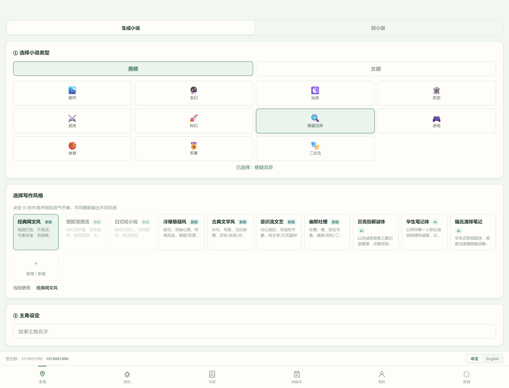
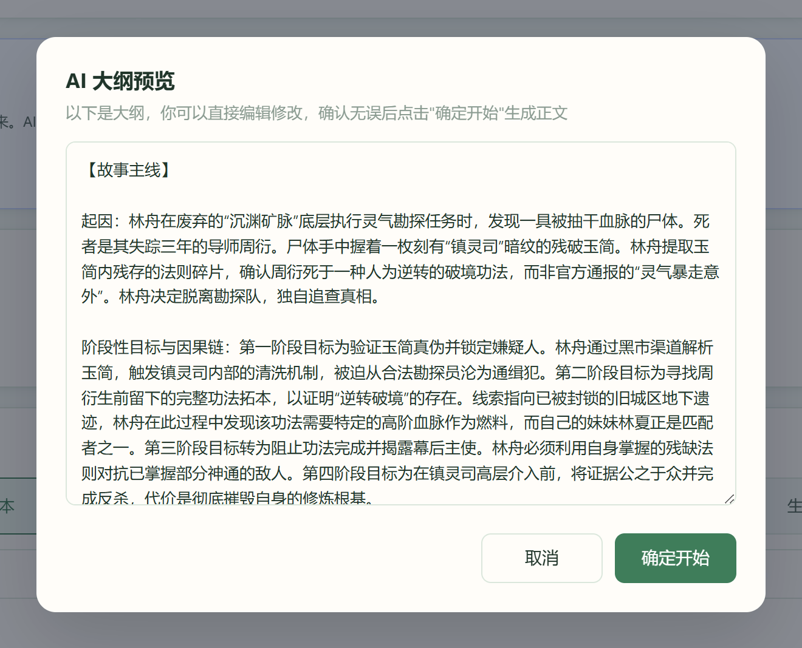
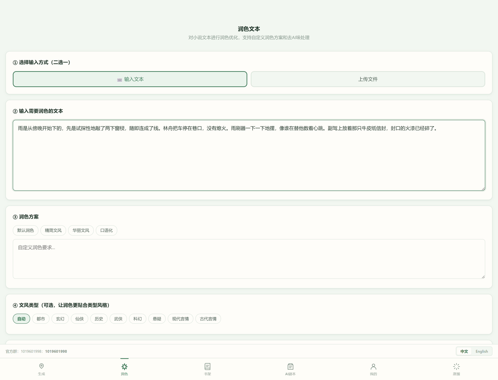
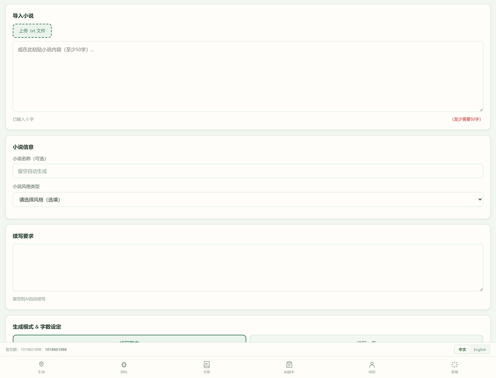

<div align="center">

# MirrorNovel

**面向长篇创作的 AI 小说写作平台**

从大纲到蓝图，从正文到润色 —— 一条由 AI 驱动、全程可确认、可干预的创作流水线

[](https://nodejs.org)
[](https://www.mongodb.com)
[](https://vuejs.org)
[](https://expressjs.com)
[](LICENSE)

[简体中文](#核心特性) · [English](#english-version)

</div>

> **交流**：作者平时上班较忙，可以加企鹅群 **1019601998** 直接和作者交流

---

<div align="center">
  
  
</div>

---

<a id="readme-zh"></a>

## 核心特性

| 能力 | 说明 |
|---|---|
| 整本 & 单章创作 | 普通小说（男频/女频题材）与轻小说双模式，支持整本连写与单章精写 |
| 大纲 → 蓝图 → 正文 | 大纲先生成、可编辑、需确认；故事蓝图由 AI 提出阶段/支线/反转，确认后才用于正文 |
| 全程流式可视 | 大纲、蓝图、正文均以 SSE 实时推送，思考过程与正文同步展示并自动追踪最新内容；关闭页面即中止，不空烧 token |
| 长篇连贯性引擎 | 持久化章节摘要、伏笔、角色状态、情绪曲线与未决问题，跨章自动回收伏笔 |
| 写作人格 | 系统预设 / 手动模板 / AI 生成人格控制叙述声线与节奏；作品保存人格快照，改模板不影响已有作品 |
| 专家团模式 | 每章写作后自动连续性审稿，发现问题自动修订并提示 |
| 润色与编辑引擎 | 流式润色导出、两遍法去 AI 味（含差异对比、回写章节）、三阶段编辑引擎（结构重构 → 风格一致 → 去 AI 化） |
| 导入续写 | 上传 `.txt` 或粘贴正文，AI 整理既有剧情上下文后继续创作 |
| 书架与章节管理 | 章节查看/编辑/导出、关键字提取、后台全文调优任务 |
| 多模型线路 | 按任务类型（大纲/正文/推理/润色/记忆）分别指定线路，支持任何 OpenAI Chat Completions 兼容服务与 Ollama |
| 实时 token 用量 | 大纲、蓝图与整本生成过程实时展示输入/输出 token 消耗 |
| 管理端 | 数据大屏、用户管理、模型线路统一维护 |
| 多端 | Vue 用户端、管理端与 uni-app 移动端 |

> **模型兼容性说明**：深度思考模型（GLM 深度思考、DeepSeek-R1 等）已完整支持——思考预算与正文预算分离（思考不会挤占正文字数），思考失控会被自动掐断并收紧策略重试，思考进度实时展示且不计入正文字数。默认按任务角色分配思考策略（正文限篇幅、润色不思考、大纲/审稿给更大预算），可用 `AI_THINKING_MODE` / `AI_THINKING_BUDGET` / `AI_THINKING_MAX_CHARS` 等环境变量调整。

## 界面速览

<table>
  <tr>
    <td align="center"><br/>润色 — 流式改写与导出</td>
    <td align="center"><br/>续写 — 导入 TXT 接着写</td>
  </tr>
</table>

## 系统架构

```text
浏览器 / uni-app 移动端
        │
        ├── 用户端 (Vue 3, :5173) ──┐
        ├── 管理端 (Vue 3, :5174) ──┤  SSE 流式 / REST
        ▼                          │
Express API 服务 (Node.js, :3000) ─┘
        │
        ├── OpenAI-compatible 模型服务 / Ollama
        ├── MongoDB（作品 / 章节 / 伏笔 / 人格 / 系统配置）
        └── SMTP 邮箱（注册与找回密码验证码）
```

## 项目结构

```text
MirrorNovel/
├── server/                       # Express + Mongoose 服务端
│   ├── config/                   # 数据库、模型目录、题材、模板与编辑规则
│   ├── middleware/               # JWT 鉴权
│   ├── models/                   # User、Novel、WritingPersona、SysConfig、VerificationCode
│   ├── routes/                   # auth、novel、persona、admin
│   ├── services/                 # AI、上下文、故事状态、编辑引擎、token 统计
│   └── tests/                    # Node 内置测试（69 用例）
├── client/                       # Vue 3 用户端（生成/续写/书架/润色/资料）
├── admin/                        # Vue 3 管理端（大屏/用户/模型线路）
├── app/                          # uni-app 移动端
├── docs/                         # 补充文档与界面截图
├── PROJECT_ARCHITECTURE.md       # 详细架构与 API 文档
└── LICENSE
```

## 快速开始

### 环境要求

- Node.js ≥ 18
- MongoDB ≥ 6
- 任一 OpenAI Chat Completions 兼容模型服务，或可用的 Ollama
- （可选）Playwright Chromium：用于内容导入辅助

### 安装与启动

```bash
git clone https://github.com/Aerdelan/MirrorNovel.git
cd MirrorNovel

# 安装依赖
cd server && npm install && cd ../client && npm install && cd ../admin && npm install && cd ../app && npm install

# 配置服务端环境变量
cd ../server
copy .env.example .env      # Windows
# cp .env.example .env      # macOS / Linux
```

启动（三个终端）：

```bash
cd server && npm run dev    # API 服务 :3000
cd client && npm run dev    # 用户端 :5173
cd admin && npm run dev     # 管理端 :5174
```

用户端与管理端通过 Vite 代理把 `/api` 转发到 `:3000`。首次启动时服务端会按 `ADMIN_EMAIL` / `ADMIN_PASSWORD` 自动创建管理员账号。

## 环境变量

<details>
<summary>server/.env 最小示例（点击展开）</summary>

```env
MONGODB_URI=mongodb://127.0.0.1:27017/mirrornovel
PORT=3000

JWT_SECRET=replace_with_a_long_random_secret
JWT_EXPIRES_IN=7d

ADMIN_EMAIL=admin@example.com
ADMIN_PASSWORD=replace_with_a_strong_password
ADMIN_NICKNAME=管理员

# 默认模型线路
AI_API_BASE=https://api.example.com/v1
AI_API_KEY=replace_with_your_api_key
AI_MODEL=your-model-name

# 邮箱验证码（可选，未配置时开发环境会在日志中打印验证码）
EMAIL_HOST=smtp.example.com
EMAIL_PORT=465
EMAIL_USERNAME=noreply@example.com
EMAIL_PASSWORD=replace_with_smtp_password
EMAIL_SECURE=true
```

> 请勿提交真实密钥。

</details>

## 模型线路

预置线路 ID：`normal_1`、`normal_2`、`advanced_1`、`vip`、`svip`，前缀加 `_BASE_URL` / `_API_KEY` / `_MODEL` 即可通过环境变量配置：

```env
MODEL_NORMAL_1_BASE_URL=https://api.example.com/v1
MODEL_NORMAL_1_API_KEY=replace_with_your_api_key
MODEL_NORMAL_1_MODEL=your-model-name
```

- 用户在「个人资料」中选择默认线路，并可针对 `outline`、`writing`、`reasoning`、`polish`、`memory` 分别指定线路。
- 管理员在管理端「模型配置」中统一维护线路地址、模型名与密钥。
- Ollama：常见本机地址 `http://localhost:11434`；跨设备访问需按 Ollama 文档配置监听与 CORS。

## 使用流程

**创作一部新小说**

1. 登录后打开「生成」，选择题材（男频 / 女频 / 轻小说）
2. 填写主角与世界观；整本模式下先生成大纲，实时流式展示，可编辑后确认
3. 生成并确认初始故事蓝图（阶段 / 支线 / 反转，AI 只提方案，不改剧情）
4. 选择写作人格与目标字数，开始创作 —— 正文逐段流入，章节计划、思考进度与 token 用量实时可见
5. 在书架或作品详情中继续写作、编辑章节、去 AI 味、提取关键字或发起全文调优

**导入续写**

1. 打开「续写」，上传 UTF-8 `.txt` 或粘贴正文
2. 填写续写方向、目标字数与模式
3. 系统整理导入文本的上下文（人物 / 伏笔 / 事件）后开始续写

## API 概览

完整接口与数据模型见 [PROJECT_ARCHITECTURE.md](PROJECT_ARCHITECTURE.md)。

| 前缀 | 说明 |
|---|---|
| `/api/auth` | 注册、登录、邮箱验证码、找回密码、模型配置 |
| `/api/novel/types` | 题材分类 |
| `/api/novel/generate-outline` | 大纲生成（SSE：思考 + 正文流式） |
| `/api/novel/generate-blueprint` | 故事蓝图生成（SSE） |
| `/api/novel/generate` | 整本 / 单章生成（SSE） |
| `/api/novel/continue/:id` · `/continue-import` | 续写（SSE） |
| `/api/novel/bookshelf` · `/novel/:id` | 书架与章节管理 |
| `/api/novel/deslop-stream` · `/polish` · `/editorial-stream` | 去 AI 味 / 润色 / 编辑引擎（SSE） |
| `/api/persona` | 写作人格增删改克隆与 AI 生成 |
| `/api/admin` | 管理端：用户、模型线路、数据概览 |

## 测试与构建

```bash
cd server && npm test        # 69 个用例：模型路由、思考参数兼容、故事状态、上下文、SSE 生成、续写、暂停、重复保护等
cd client && npm run build   # 用户端构建
cd admin && npm run build    # 管理端构建
cd app && npm run build:h5   # uni-app H5 构建
```

## 部署建议

- 用 `npm run build` 产出静态资源，经 Nginx / Caddy 托管，反代 `/api` 至 Express；
- API 服务用 systemd / PM2 / Docker Compose 守护；
- MongoDB 仅绑定受信网络；JWT 密钥、管理员密码、SMTP 与模型密钥各自独立且随机；
- 开启 HTTPS、合理的反代超时（SSE 长连接）与日志轮转；定期备份并验证可恢复。

## 安全说明

- 密码 bcrypt 哈希存储；API 使用 JWT 鉴权；重置验证码限时有效且不暴露账户存在性；
- 生产环境请补充登录与验证码频率限制、审计日志与网络访问控制；
- 不要提交 `.env`、数据库文件与任何密钥；
- AI 输出仅作创作辅助，发布前请自行审核内容与合规要求。

## 已知限制

- 长篇生成质量依赖模型上下文能力与服务稳定性；
- 深度思考模型的首字响应时间取决于线路速度与思考预算配置（见「模型兼容性说明」）；
- 本地开发依赖可用的 MongoDB，未启动时 API 服务无法运行。

## 开源协议

见 [LICENSE](LICENSE)。使用、修改或分发前请阅读协议全文，并遵守所用模型服务、第三方库与内容来源的条款。

---

<a id="readme-en"></a>

## English Version

<div align="center">

**AI-powered platform for long-form fiction writing**

Outline → Blueprint → Chapters → Polish — a fully streaming, always-confirmable AI writing pipeline

</div>

> **Contact**: the author is usually busy on workdays — join QQ group **1019601998** to reach the author directly.

### Highlights

| Capability | Description |
|---|---|
| Whole-book & single-chapter modes | Webnovel genres (male/female-oriented) and light novels |
| Outline → Blueprint → Prose | Outlines are generated live, editable, and must be confirmed; story blueprints (phases / subplots / reversals) are proposed by AI and only applied after confirmation |
| Streaming everywhere | Outline, blueprint, and prose are all pushed over SSE in real time with auto-scrolling; closing the page aborts generation — no wasted tokens |
| Long-range continuity engine | Chapter summaries, foreshadowing, character states, emotional curves and open questions persist and are reused across chapters |
| Writing personas | System presets, manual templates, or AI-generated personas control voice and rhythm; each book snapshots its persona |
| Expert review mode | Automatic continuity review after every chapter, with auto-revision when needed |
| Polish & editorial engine | Streaming polish with export; two-pass de-AI rewriting with diff view; three-stage editorial workflow |
| Import & continue | Upload `.txt` or paste existing prose; the AI reconstructs context and continues the story |
| Multi-route model config | Per-task routing (`outline` / `writing` / `reasoning` / `polish` / `memory`) across any OpenAI-compatible provider or Ollama |
| Live token usage | Input/output token costs are shown live during outline, blueprint, and generation |
| Admin console | Dashboard, user management, model route maintenance |
| Multi-platform | Vue web client, admin SPA, and uni-app mobile app |

> **Model compatibility**: deep-thinking models (GLM thinking, DeepSeek-R1, etc.) are fully supported — the thinking budget is separated from the prose budget so reasoning never eats chapter length, runaway reasoning is cut off and retried with a tighter policy automatically, and thinking progress is streamed live. Per-role defaults apply (concise for prose, off for polish); tune via `AI_THINKING_MODE` / `AI_THINKING_BUDGET` / `AI_THINKING_MAX_CHARS`.

### Quick Start

```bash
git clone https://github.com/Aerdelan/MirrorNovel.git
cd MirrorNovel
cd server && npm install && cp .env.example .env   # fill in MongoDB / JWT / model route
cd ../client && npm install && cd ../admin && npm install && cd ../app && npm install

cd ../server && npm run dev   # API  :3000
cd client  && npm run dev     # Web  :5173
cd admin   && npm run dev     # Admin:5174
```

Requirements: Node.js ≥ 18, MongoDB ≥ 6, and any OpenAI Chat Completions compatible model service (or Ollama).

### Screenshots

| | |
|---|---|
|  |  |

### Docs

- Full architecture & API reference: [PROJECT_ARCHITECTURE.md](PROJECT_ARCHITECTURE.md)
- Security: bcrypt password hashing, JWT auth, expiring reset codes; never commit `.env` or keys.
- License: see [LICENSE](LICENSE).

<div align="center">

<sub>Built for long-form storytelling — 让长篇创作有始有终。</sub>

</div>
